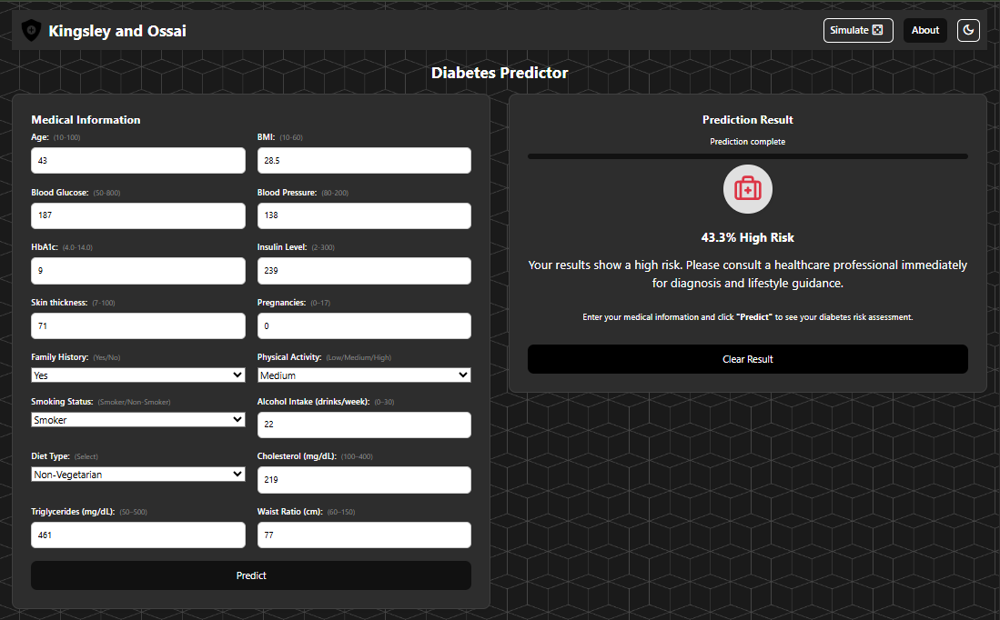

# Diabetes Predictor

A web application for making predictions using a machine learning model.

<div style="text-align: center; margin-bottom: 10px;">
  <a href="https://diabetes-predictor-li8h.onrender.com" target="_blank">
    
  </a>
</div>

## Live Demo

You can try out the app here:  
[Diabetes Predictor Web App](https://diabetes-predictor-li8h.onrender.com)


## Features

- User-friendly web interface
- Form input for predictions
- Displays prediction results

## Technologies Used

- Python
- Flask
- scikit-learn
- HTML/CSS

## Setup Instructions

1. Clone the repository:
   ```sh
   git clone https://github.com/Longman-max/diabetes-predictor.git
   cd Diabetes-Predictor
   ```
2. Create and activate a virtual environment:
   ```sh
   python -m venv .venv
   # On Windows:
   .venv\Scripts\activate
   # On macOS/Linux:
   source .venv/bin/activate
   ```
3. Install dependencies:
   ```sh
   pip install -r requirements.txt
   ```
4. Run the application:
   ```sh
   python train_model.py # optional
   python app.py
   ```
5. Open your browser and go to `http://127.0.0.1:5000/`

## Project Structure

- `app.py` - Main Flask application
- `static/` - CSS and static files
- `templates/` - HTML templates
- `model.pkl` - Machine learning model (required)

## License

This project is for educational purposes.
